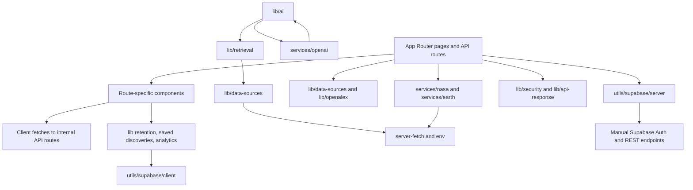
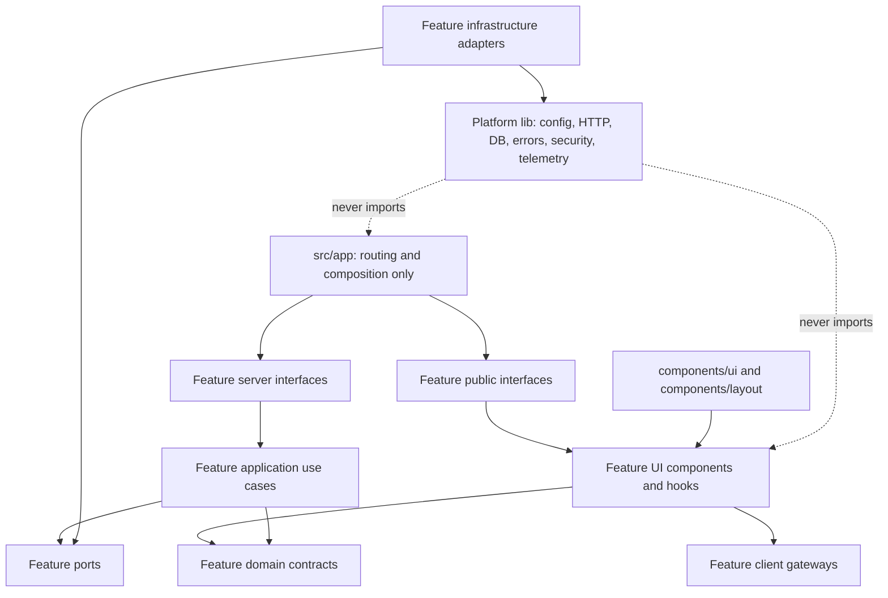

# COSMOS AI Codebase Architecture Refactor Plan

> **For agentic workers:** REQUIRED SUB-SKILL: Use superpowers:subagent-driven-development (recommended) or superpowers:executing-plans to implement this plan task-by-task. Steps use checkbox (`- [ ]`) syntax for tracking.

**Goal:** Incrementally restructure COSMOS AI into a feature-oriented, production-ready codebase with explicit domain, application, infrastructure, UI, database, provider, and route boundaries while preserving all current behavior.

**Architecture:** Use a strangler-style migration. Keep App Router pages and route URLs stable, add platform contracts and feature public interfaces beside the existing code, migrate consumers in independently testable slices, and remove compatibility modules only after all imports and behavior checks pass.

**Tech Stack:** Next.js 16 App Router, React 19, TypeScript 5 strict mode, Tailwind CSS 3, Supabase REST/Auth with RLS, Groq/OpenAI-compatible AI providers, NASA/OpenAlex/arXiv/CORE integrations, Node test runner, Vercel.

## Global Constraints

- Do not rewrite the application from scratch.
- Preserve all routes, UI design, authentication, Google OAuth, source cards, streaming, chat auto-scroll, NASA features, research retrieval, rate limits, and security controls.
- Keep every migration phase deployable and independently reversible.
- Do not overwrite or revert the existing dirty worktree.
- Do not introduce microservices, queues, Kubernetes, a global state library, or a dependency-injection framework.
- Keep route handlers thin: validate, authenticate, authorize, rate-limit, delegate, map, log, return.
- UI modules may call feature client gateways or server actions, but not Supabase REST, NASA, scholarly, or AI providers directly.
- Server identity always comes from the authenticated Supabase session; RLS remains authoritative.
- Provider-specific payloads terminate inside adapters.
- All public boundaries accept validated data and return domain-friendly discriminated unions.
- No production implementation begins until this audit and plan are approved.

---

## 1. Executive Summary

COSMOS AI is functionally healthy but architecturally concentrated. The current baseline passes lint, strict TypeScript, all 44 configured tests, the security checker, and a production build of 54 routes. The static `@/` import graph contains 203 TypeScript modules, 311 internal edges, and no detected cycles. This is a good foundation for an incremental refactor.

The primary issue is not broken behavior or circular imports. It is blurred ownership:

- API orchestration, NASA context building, scholarly retrieval, validation, caching, fallbacks, and response mapping coexist in a 996-line AI route.
- AI domain contracts live in `services/openai`, even though Groq and generic tool modules depend on them.
- Supabase authentication, profile access, preferences, saved discoveries, and Mission Control layout access share one 487-line server module.
- Server pages and routes duplicate briefing retrieval and call OpenAI directly.
- Large client components own network access, persistence, state machines, normalization, presentation, and accessibility in single files over 1,000 lines.
- Configuration, validation, HTTP errors, and route response shapes have several parallel conventions.
- CI, route integration tests, browser tests, formatting checks, architecture checks, and dependency/dead-code checks are absent.
- Multiple demonstrably unreferenced visual modules and legacy CSS remain after prior UI iterations.

The recommended target is feature-oriented architecture with a small platform layer. App Router files remain composition roots. Each feature owns domain types, use cases, adapters, server entry points, UI components, hooks, and validation. Generic platform code owns configuration, errors, HTTP, database transport, security, telemetry, and generic validation primitives. Cross-feature access occurs through explicit client-safe or server-only public entry points.

Estimated implementation effort is **10-14 senior-engineer weeks** for the full migration, or **5-7 calendar weeks for a three-engineer team** working in coordinated feature slices. The highest-value first tranche is platform boundaries, Supabase repositories, AI orchestration, briefing deduplication, and architecture enforcement.

---

## 2. Audit Scope And Baseline Evidence

### Repository metrics

| Area | Files | Text/code lines |
| --- | ---: | ---: |
| `src/app` | 69 | 6,353 |
| `src/components` | 52 | 15,143 |
| `src/lib` | 58 | 5,493 |
| `src/services` | 19 | 2,753 |
| `src/utils` | 5 | 676 |
| `tests` | 8 | 1,164 |
| `scripts` | 3 | 253 |
| `docs` before this plan | 8 | 2,073 |

The codebase contains 140 `.ts` files, 73 `.tsx` files, one 1,898-line global CSS file, six public media assets, and a 3.18 MB homepage video.

### Quality baseline executed on 2026-07-20

| Command | Result |
| --- | --- |
| `npm.cmd run lint` | PASS, 92.8 seconds |
| `npm.cmd run typecheck` | PASS, 20.1 seconds |
| `npm.cmd run test` | PASS, 44/44 tests, 3.7 seconds test duration |
| `npm.cmd run security:check` | PASS, 187 source files inspected |
| `npm.cmd run build` | PASS, 54 routes generated, 170.8 seconds |

The build printed a trailing restricted-network `fetch failed`/`EACCES` warning after successful route generation. This does not fail the build, but build-time external calls should be isolated and diagnosed so production builds are deterministic.

### Git safety baseline

The worktree already contains extensive modified and untracked security, scholarly retrieval, documentation, evaluation, and generated files. Implementation must not reset, clean, or overwrite them. `next-env.d.ts` and `tsconfig.tsbuildinfo` are generated/build-touched files; they must not be manually edited. `tsconfig.tsbuildinfo` should eventually be untracked and ignored after owner approval.

---

## 3. Current Repository Architecture



### Current layers

1. **App Router**: 20 user-facing page routes, 34 API route files, auth actions, metadata, loading/error boundaries, robots, and sitemap.
2. **Components**: route-oriented presentation folders plus generic `ui` and `visuals`; many feature components also own fetch, normalization, storage, and workflow state.
3. **Services**: NASA, Earth, OpenAI, and research-tool modules. Naming implies vendor ownership even when contracts are generic.
4. **Lib**: AI policies, retrieval, public data sources, security, retention, analytics, API responses, environment access, OpenAlex, and general utilities.
5. **Utils**: Supabase client, middleware, auth flow, server transport, and manually maintained types.
6. **Persistence**: localStorage client helpers and direct Supabase REST calls from the broad server helper.
7. **Tests**: deterministic unit and security tests focused on retrieval, response quality, query intent, and route-independent security utilities.

### Current strengths

- Strict TypeScript is enabled.
- App Router pages generally compose dedicated route components.
- NASA services normalize errors and rate-limit metadata.
- Scholarly retrieval has provider isolation, timeout handling, normalization, deduplication, and strong deterministic tests.
- Server-only markers exist across research/data modules.
- Security controls cover same-origin mutation, bounded JSON, URL safety, rate limits, CSP, RLS checks, and secret scans.
- Dynamic imports protect large gallery, image-explorer, solar-system, and source-card bundles.
- No static alias-import cycles were detected.
- External data failures usually degrade to honest fallback states.

---

## 4. Current Dependency Map

### Highest-volume internal dependency groups

| Dependency direction | Static edges | Interpretation |
| --- | ---: | --- |
| `app/api/cosmos` -> `lib/data-sources` | 22 | Thin route family, but response/validation conventions are local |
| `app/api/cosmos` -> `lib/api-response` | 15 | Shared envelope exists but differs from NASA/security routes |
| `lib/ai` -> `lib/data-sources` | 13 | AI context directly knows provider modules |
| `lib/data-sources` -> `lib/env` | 12 | Centralized provider configuration is partly established |
| `app/api/nasa` -> `services/nasa` | 11 | Healthy adapter direction |
| `lib/ai` -> `services/openai` | 4 | Generic AI policy depends on vendor-named service contracts |
| `services/openai` -> `lib/ai` | 5 | Conceptual bidirectional ownership even without a file-level cycle |
| `components/auth` -> `utils/supabase` | 3 | UI knows transport/auth implementation directly |

### Most imported modules

| Module | Incoming imports | Risk |
| --- | ---: | --- |
| `src/lib/env.ts` | 22 | Central but incomplete configuration boundary |
| `src/services/nasa/index.ts` | 21 | Broad barrel may mix runtime and type exports |
| `src/lib/api-response.ts` | 20 | Useful but incomplete error vocabulary |
| `src/lib/saved-discoveries.ts` | 12 | Mixes domain model, localStorage, auth detection, and HTTP client |
| `src/utils/supabase/server.ts` | 11 | Auth plus four repository responsibilities |
| `src/services/openai/index.ts` | 11 | Vendor barrel exports shared chat/domain contracts |
| `src/components/home/animated-starfield.tsx` | 10 | Shared presentation imported from feature-specific folder |

### Largest outgoing dependency hub

`src/app/api/ai/chat/route.ts` imports 18 internal modules. It is the clearest route-boundary violation and the first server feature that should be strangled behind a use-case interface.

### Dependency rule violations or leaks

- `components/dashboard/saved-discoveries-dashboard.tsx`, auth components, and navigation components import Supabase client helpers directly.
- Account UI imports server actions from `src/app/auth/actions.ts`, reversing the desired `app -> feature` direction.
- Groq provider code imports generic request/source types from `services/openai`.
- `src/app/briefing/page.tsx` and `/api/briefing/daily` each implement OpenAI response generation and NASA/news normalization.
- `src/app/mission-control/page.tsx` directly orchestrates Supabase, OpenAlex, Earth service, blog content, and presentation DTO construction.
- Client components import types through broad server-service barrels. Type-only imports are currently safe, but the boundary is fragile.
- `src/lib/saved-discoveries.ts` is a client repository, local repository, fallback policy, and domain type module simultaneously.

---

## 5. High-Risk Files

| Priority | File | Lines | Current responsibilities | Required split |
| --- | --- | ---: | --- | --- |
| Critical | `src/app/api/ai/chat/route.ts` | 996 | HTTP security, validation, auth, limits, NASA context, retrieval, ranking, source cards, caching, fallback, provider invocation | Route controller, request schema, Ask COSMOS use case, context providers, source-card mapper |
| Critical | `src/services/openai/chat.service.ts` | 860+ | Domain types, cache, prompts, OpenAI transport, streaming parser, fallbacks, status headers | Domain contracts, prompt policy, cache, OpenAI adapter, stream encoder, fallback policy |
| Critical | `src/services/ai/research-tools.service.ts` | 692 | Tool selection, cache, HTTP, NASA, arXiv, Wikipedia, ISS, weather, OpenAlex authors/institutions | Tool registry plus one adapter per provider; converge with retrieval layer |
| Critical | `src/utils/supabase/server.ts` | 487 | Config, REST transport, auth, cookies, sessions, profiles, preferences, discoveries, layouts | Supabase transport/auth plus feature repositories |
| Critical | `src/app/briefing/page.tsx` | 554 | Page composition, feed parsing, NASA normalization, fallback summary, direct OpenAI call, data loading | Thin page and one shared briefing use case |
| Critical | `src/app/api/briefing/daily/route.ts` | 344 | Duplicate briefing retrieval, normalization, direct OpenAI call, HTTP response | Thin route using the same briefing use case |
| High | `src/components/assistant/cosmos-assistant.tsx` | 1,575 | Domain types, persistence, API client, parsing, state, commands, composer, messages, Markdown, source cards | Hook/controller, API client, persistence, presentation components, markdown renderer |
| High | `src/components/solar-system/solar-system-explorer.tsx` | 1,354 | Planet data, texture generation, Three scene, device detection, controls, detail and comparison UI | Domain catalog, rendering engine, hooks, scene, panels, fallback |
| High | `src/components/image-explorer/nasa-image-explorer.tsx` | 1,274 | Types, fallback archive, normalization, search, paging, save, AI, viewer, cards, states | Client gateway, hook, normalization, grid, viewer, states |
| High | `src/components/earth/live-earth-dashboard.tsx` | 1,000 | Polling, API parsing, storage, formatting, all dashboard panels and modals | Live-signal hook, gateway, metrics, alert, view, reference, actions |
| High | `src/components/briefing/mission-control-briefing.tsx` | 981 | DTOs, scoring, all editorial panels, AI summary state | Feature types, selectors, page shell, section components |
| High | `src/app/globals.css` | 1,898 | Tokens, glass primitives, buttons, global motion, multiple hero generations, two Earth systems, page-specific styles | Ordered style modules with one entry point |
| High | `src/lib/openalex.ts` | 576 | Raw types, transport, retries, cache, normalization, four entity services | OpenAlex adapter transport, schemas, mappers, repositories |
| High | `src/lib/retrieval/relevance-score.ts` | 559 | Domain types, relevance, ranking, deduplication, source-set gates | Ranking policy, deduplication, source selection |
| Medium | `src/components/asteroids/asteroid-tracker.tsx` | 718 | Fetch, normalization, chart-like presentation, AI requests, interactions | Hook/gateway and presentation split |
| Medium | `src/components/gallery/nasa-gallery.tsx` | 685 | Search, AI, modal, media state, formatting | Reuse NASA media client and shared viewer primitives |
| Medium | `src/components/home/cosmos-hero-features.tsx` | 653 | Unreferenced former homepage system | Verify history, then remove |

No large file should be split solely to meet a line limit. The boundaries above are meaningful because they separate policy, transport, state, and presentation that change for different reasons.

---

## 6. Technical Debt Findings

### 6.1 Responsibility and ownership

1. **Server orchestration in routes**: AI and briefing routes contain domain and provider logic.
2. **Business logic in client components**: Assistant, image explorer, Earth, asteroid, and gallery components normalize data and own network workflows.
3. **Business logic in pages**: Briefing and Mission Control pages assemble provider calls and fallback policy.
4. **Generic contracts under vendor names**: `CosmosChatMessage`, source cards, and stream parameters live under `services/openai`.
5. **Broad Supabase helper**: One module changes whenever auth, account, saved discoveries, preferences, or layout storage changes.

### 6.2 Duplicate or competing implementations

1. Briefing data and OpenAI summary generation exist in both a page and API route.
2. OpenAlex exists as `lib/openalex.ts`, `lib/data-sources/openalex.ts`, API route utilities, and AI tool integration.
3. Scholarly retrieval exists in the newer `lib/retrieval` stack while `research-tools.service.ts` separately implements arXiv/OpenAlex selection and caching.
4. NASA access uses the strong `services/nasa` layer, a `lib/data-sources/nasa.ts` re-export, route utilities, and tool-specific summaries.
5. API responses use `lib/api-response`, `securityErrorResponse`, NASA route errors, OpenAlex errors, and local route-specific envelopes.
6. Input validation uses security validators, data-source helpers, route-local parsers, regular expressions in auth actions, and route-local normalizers.
7. Several generations of hero, shader, Earth orb, and glass CSS coexist.

### 6.3 Configuration

- `src/lib/env.ts` is server-only and useful, but direct `process.env` access remains in Supabase client/server/middleware, security origin/rate-limit/logger, site URL, analytics, retrieval logging, and `next.config.ts`.
- Environment values are sanitized manually but not schema-validated at startup.
- Server and browser-safe configuration are not represented by separate typed contracts.
- Provider health and feature enablement are inferred in multiple modules.

### 6.4 Database and authentication

- The project does not currently depend on `@supabase/supabase-js` or `@supabase/ssr`; it implements PKCE, cookies, Auth REST, and PostgREST manually.
- Current auth behavior passes builds and security tests, so replacing it during the structural refactor would create unnecessary risk.
- Database row types are handwritten and can drift from `supabase/schema.sql`.
- Repository queries, row mapping, and fallback behavior live in the broad Supabase server helper.
- UI directly checks browser auth status rather than consuming feature session state.

### 6.5 Provider boundaries

- OpenAI transport uses direct `fetch`, and the installed `openai` npm package has no application imports.
- Groq correctly has a provider wrapper but depends on OpenAI-named contracts.
- Briefing bypasses the provider abstraction and calls OpenAI directly.
- Provider-specific source names and model statuses appear in UI/domain types.
- `serverFetch` and NASA fetch wrappers are strong starting points but are not used consistently by every provider.

### 6.6 Error handling

- `SecurityHttpError`, `ServerFetchError`, `NasaApiError`, `OpenAlexError`, `ApiErrorCode`, local route errors, and string-pattern error classification overlap.
- HTTP mapping and response shapes differ by route family.
- Some public fallbacks intentionally suppress details, but errors lack one domain-neutral typed vocabulary.
- Build-time network failure is logged after a successful build without a clear owning provider.

### 6.7 Validation and types

- Strict TypeScript is enabled and avoidable `any` was not found in the source scan.
- Three non-null assertions remain in AI streaming and achievements code.
- External provider response validation is mostly handwritten and partial.
- Route schemas are not reusable between clients, server actions, use cases, and tests.
- Duplicate client/server chat and source-card types can drift.
- No validation library is installed; Zod is the justified candidate for boundary schemas.

### 6.8 UI architecture

- Feature folders already exist under `components`, but they contain only presentation files; state, services, schemas, and types remain elsewhere.
- Several client modules directly fetch internal APIs. Internal API calls are acceptable, but the fetch/parse/error policy should live in feature client gateways.
- Large components combine orchestration and rendering, increasing hydration cost and review risk.
- The 1,898-line global stylesheet includes old unreferenced visual systems, making CSS ownership unclear.

### 6.9 Testing and tooling

- Current tests are 44 deterministic unit/security tests and are valuable.
- No API route-to-use-case integration tests exist.
- No Supabase repository contract tests exist.
- No React interaction or browser E2E tests exist.
- No CI workflows are configured.
- No formatter or format check is configured.
- No architecture, circular-dependency, dead-code, or dependency-drift check exists.
- The single `test` script enumerates files manually, so new tests can be omitted accidentally.
- ESLint exists in both flat config and legacy `.eslintrc.json` formats.

### 6.10 Dead code and repository hygiene

The static and symbol-reference audits found these strong removal candidates:

- `src/components/ui/animated-shader-hero.tsx`
- `src/components/ui/fractal-shader-background.tsx`
- `src/components/ui/globe.tsx`
- `src/components/ui/shader-background-1.tsx`
- `src/components/home/cosmos-shader-hero-visual.tsx`
- `src/components/home/cosmos-hero-features.tsx`
- `src/components/home/retention-hub.tsx`
- `src/components/discoveries/discovery-timeline-page.tsx`
- `src/lib/data-sources/nasa.ts`
- `src/lib/security/errors.ts`
- `src/lib/security/origin.ts`
- `.eslintrc.json` after flat-config confirmation
- `openai` dependency after lockfile/deployment verification

These are candidates, not immediate deletions. Dynamic imports, route entry points, generated code, tests, and external consumers must be checked before removal.

Repository-level content under `m.d/` and `work/` appears unrelated to runtime application ownership. It should be archived or removed only after the owner confirms its purpose.

---

## 7. Proposed Target Architecture



### Design principles

1. **Feature ownership first**: Ask COSMOS, authentication, research, NASA, Earth, briefing, Mission Control, discoveries, account, image explorer, gallery, solar system, homepage, and blog own their logic.
2. **Platform layer second**: Only truly generic configuration, HTTP, database transport, errors, security, telemetry, validation primitives, and utilities remain in `lib`.
3. **Explicit application layer**: Use cases coordinate domain ports without knowing Next.js, React, Supabase REST payloads, or provider payloads.
4. **Adapter isolation**: Groq, OpenAI, NASA, OpenAlex, arXiv, CORE, and Supabase implementations satisfy ports and normalize all responses.
5. **Separate public entry points**: `index.ts` is client-safe; `server.ts` begins with `import "server-only"`; no mixed server/client barrels.
6. **Compatibility during migration**: Existing import paths re-export new modules temporarily, with removal tracked in the same feature’s final migration task.

---

## 8. Exact Target Folder Structure

```text
src/
├── app/                                  # Next.js route composition only
│   ├── api/
│   ├── auth/
│   └── <existing route segments>/
├── features/
│   ├── ask-cosmos/
│   │   ├── application/
│   │   ├── components/
│   │   ├── domain/
│   │   ├── hooks/
│   │   ├── infrastructure/
│   │   │   ├── ai-models/
│   │   │   ├── retrieval/
│   │   │   └── cache/
│   │   ├── schemas/
│   │   ├── server/
│   │   ├── tests/
│   │   ├── index.ts                     # client-safe exports only
│   │   └── server.ts                    # server-only exports only
│   ├── authentication/
│   ├── account/
│   ├── nasa/
│   ├── research/
│   ├── briefing/
│   ├── earth/
│   ├── mission-control/
│   ├── saved-discoveries/
│   ├── image-explorer/
│   ├── gallery/
│   ├── solar-system/
│   ├── homepage/
│   ├── blog/
│   └── retention/
├── lib/
│   ├── config/
│   │   ├── env.client.ts
│   │   ├── env.server.ts
│   │   ├── feature-flags.ts
│   │   └── server-status.ts
│   ├── database/
│   │   └── supabase/
│   │       ├── auth-rest.server.ts
│   │       ├── postgrest.server.ts
│   │       ├── session.server.ts
│   │       └── types.generated.ts
│   ├── errors/
│   │   ├── app-error.ts
│   │   ├── error-codes.ts
│   │   └── http-error-mapper.ts
│   ├── http/
│   │   ├── route-handler.ts
│   │   ├── responses.ts
│   │   └── server-fetch.ts
│   ├── security/                         # preserve current focused modules
│   ├── telemetry/
│   │   ├── events.ts
│   │   └── logger.server.ts
│   ├── validation/
│   │   ├── common-schemas.ts
│   │   └── parse-result.ts
│   └── utils/
│       └── cn.ts
├── components/
│   ├── layout/
│   └── ui/
├── content/
├── styles/
│   ├── tokens.css
│   ├── primitives.css
│   ├── motion.css
│   ├── home.css
│   ├── earth.css
│   └── globals.css
└── types/                                # only cross-cutting ambient/public types

tests/
├── unit/
├── integration/
├── e2e/
├── fixtures/
└── factories/

scripts/
├── architecture-check.mjs
├── dependency-check.mjs
├── run-tests.mjs
├── security-check.mjs
└── eval-*.ts
```

The structure is a destination, not a command to move everything at once. A feature folder is created only when that feature enters a migration phase.

---

## 9. Module Dependency Rules

### Allowed directions

```text
app -> feature index/server
feature components/hooks -> feature domain + feature client gateway + components/ui
feature application -> feature domain + ports + other feature public server contracts
feature infrastructure -> feature ports + platform lib
feature server -> feature application + feature infrastructure
platform lib -> platform lib only
components/ui -> React + generic platform utilities only
```

### Forbidden directions

1. `components/ui` must not import any feature, app, database, provider, or server module.
2. Client modules must not import `*.server.ts`, server-only feature entry points, Supabase transport, provider adapters, or secrets.
3. Domain modules must not import React, Next.js, Supabase, `fetch`, environment configuration, or provider types.
4. Application use cases must not import NextRequest, NextResponse, React, or raw provider payloads.
5. Infrastructure adapters must not import feature UI.
6. Platform `lib` must not import from `app`, feature components, or feature use cases.
7. App routes must not deep-import feature internals; use `index.ts` or `server.ts`.
8. Cross-feature imports must target the providing feature’s public entry point or an explicit port contract.
9. `process.env` is allowed only in `lib/config`, Next configuration, and narrowly documented bootstrap files.
10. Direct Supabase `/rest/v1` and `/auth/v1` calls are allowed only in `lib/database/supabase`.
11. Direct external provider URLs are allowed only in the owning infrastructure adapter.

### Enforcement

`scripts/architecture-check.mjs` will use the already-installed TypeScript compiler API to parse imports, detect cycles, classify client/server modules, and reject forbidden edges. It will also report files above advisory thresholds, direct `process.env`, direct Supabase REST, and direct provider URL usage outside approved paths. Large-file limits begin as warnings; import/security boundaries fail CI immediately.

---

## 10. Typed Application Contracts

### Application error

Create a domain-neutral `AppError` with:

- code: `VALIDATION_ERROR`, `UNAUTHENTICATED`, `UNAUTHORIZED`, `RATE_LIMITED`, `NOT_FOUND`, `PROVIDER_TIMEOUT`, `PROVIDER_UNAVAILABLE`, `DATABASE_ERROR`, `CONFIGURATION_ERROR`, or `INTERNAL_ERROR`
- safe public message
- optional internal cause
- optional redacted metadata
- retryable flag
- optional HTTP status hint used only by the route mapper

Existing `SecurityHttpError`, `ServerFetchError`, `NasaApiError`, and `OpenAlexError` remain adapter-specific during migration and map into `AppError` at feature boundaries. They are not all deleted in the first phase.

### Result contract

Use a simple discriminated union at public application boundaries:

```ts
type Result<T, E extends AppError = AppError> =
  | { ok: true; value: T }
  | { ok: false; error: E };
```

Do not wrap every internal function in `Result`; reserve it for use cases, repositories, and adapters where failure is expected and actionable.

### Provider ports

- `AIModelProvider`: `generate` and `stream` normalized model events.
- `ResearchProvider`: normalized query, result, timeout, and provenance.
- `NasaDataProvider`: focused APOD, media, NeoWs, DONKI, and Mars methods rather than one generic endpoint method.
- `UsageRepository`, `ProfileRepository`, `SavedDiscoveryRepository`, `MissionControlLayoutRepository`: domain models only.

---

## 11. Files To Create

The following are exact planned files. They are introduced by phase rather than all at once.

### Platform core

- `src/lib/config/env.server.ts`
- `src/lib/config/env.client.ts`
- `src/lib/config/feature-flags.ts`
- `src/lib/config/server-status.ts`
- `src/lib/errors/app-error.ts`
- `src/lib/errors/error-codes.ts`
- `src/lib/errors/http-error-mapper.ts`
- `src/lib/http/route-handler.ts`
- `src/lib/http/responses.ts`
- `src/lib/http/server-fetch.ts`
- `src/lib/telemetry/events.ts`
- `src/lib/telemetry/logger.server.ts`
- `src/lib/validation/common-schemas.ts`
- `src/lib/validation/parse-result.ts`
- `src/lib/database/supabase/auth-rest.server.ts`
- `src/lib/database/supabase/postgrest.server.ts`
- `src/lib/database/supabase/session.server.ts`
- `src/lib/database/supabase/types.generated.ts`

### Authentication and repositories

- `src/features/authentication/application/get-session.ts`
- `src/features/authentication/infrastructure/supabase-auth.repository.ts`
- `src/features/authentication/server/actions.ts`
- `src/features/authentication/server/callback.ts`
- `src/features/authentication/schemas/auth.schemas.ts`
- `src/features/authentication/index.ts`
- `src/features/authentication/server.ts`
- `src/features/account/domain/profile.ts`
- `src/features/account/application/get-account.ts`
- `src/features/account/application/update-profile.ts`
- `src/features/account/infrastructure/profile.repository.ts`
- `src/features/account/infrastructure/preferences.repository.ts`
- `src/features/account/server.ts`
- `src/features/saved-discoveries/domain/saved-discovery.ts`
- `src/features/saved-discoveries/application/list-discoveries.ts`
- `src/features/saved-discoveries/application/save-discovery.ts`
- `src/features/saved-discoveries/application/delete-discovery.ts`
- `src/features/saved-discoveries/infrastructure/local-discovery.repository.ts`
- `src/features/saved-discoveries/infrastructure/supabase-discovery.repository.ts`
- `src/features/saved-discoveries/client/discovery-api.ts`
- `src/features/saved-discoveries/index.ts`
- `src/features/saved-discoveries/server.ts`
- `src/features/mission-control/infrastructure/layout.repository.ts`

### NASA, research, and briefing

- `src/features/nasa/domain/nasa.models.ts`
- `src/features/nasa/application/nasa.service.ts`
- `src/features/nasa/infrastructure/nasa-http.adapter.ts`
- `src/features/nasa/server.ts`
- `src/features/research/domain/research.models.ts`
- `src/features/research/domain/research-provider.ts`
- `src/features/research/application/search-research.ts`
- `src/features/research/application/rank-research.ts`
- `src/features/research/infrastructure/openalex.adapter.ts`
- `src/features/research/infrastructure/arxiv.adapter.ts`
- `src/features/research/infrastructure/core.adapter.ts`
- `src/features/research/server.ts`
- `src/features/briefing/domain/briefing.ts`
- `src/features/briefing/application/get-daily-briefing.ts`
- `src/features/briefing/application/generate-briefing-summary.ts`
- `src/features/briefing/infrastructure/nasa-news.adapter.ts`
- `src/features/briefing/server.ts`

### Ask COSMOS

The approved hybrid scientific review plan remains authoritative for this feature:

- `src/features/ask-cosmos/domain/chat.ts`
- `src/features/ask-cosmos/domain/source-card.ts`
- `src/features/ask-cosmos/domain/review.ts`
- `src/features/ask-cosmos/application/answer-question.ts`
- `src/features/ask-cosmos/application/build-conversation-context.ts`
- `src/features/ask-cosmos/application/build-tool-context.ts`
- `src/features/ask-cosmos/infrastructure/ai-models/groq.adapter.ts`
- `src/features/ask-cosmos/infrastructure/ai-models/openai.adapter.ts`
- `src/features/ask-cosmos/infrastructure/cache/chat-cache.ts`
- `src/features/ask-cosmos/server/chat-controller.ts`
- `src/features/ask-cosmos/server/chat-request.schema.ts`
- `src/features/ask-cosmos/client/chat-api.ts`
- `src/features/ask-cosmos/hooks/use-cosmos-chat.ts`
- `src/features/ask-cosmos/components/assistant-shell.tsx`
- `src/features/ask-cosmos/components/conversation.tsx`
- `src/features/ask-cosmos/components/message-bubble.tsx`
- `src/features/ask-cosmos/components/prompt-composer.tsx`
- `src/features/ask-cosmos/components/mode-controls.tsx`
- `src/features/ask-cosmos/components/markdown-response.tsx`
- `src/features/ask-cosmos/components/research-source-card.tsx`
- `src/features/ask-cosmos/index.ts`
- `src/features/ask-cosmos/server.ts`

The detailed review modules from `docs/superpowers/plans/2026-07-20-hybrid-scientific-review.md` live under `src/features/ask-cosmos/application/review/` rather than creating a second generic AI domain.

### UI feature splits

- `src/features/image-explorer/client/nasa-media-api.ts`
- `src/features/image-explorer/hooks/use-image-search.ts`
- `src/features/image-explorer/components/media-grid.tsx`
- `src/features/image-explorer/components/media-card.tsx`
- `src/features/image-explorer/components/media-viewer.tsx`
- `src/features/image-explorer/components/explorer-states.tsx`
- `src/features/earth/client/earth-live-api.ts`
- `src/features/earth/hooks/use-earth-signals.ts`
- `src/features/earth/components/earth-metrics.tsx`
- `src/features/earth/components/mission-alerts.tsx`
- `src/features/earth/components/earth-view-options.tsx`
- `src/features/earth/components/people-in-space-panel.tsx`
- `src/features/solar-system/domain/planet-catalog.ts`
- `src/features/solar-system/hooks/use-solar-system.ts`
- `src/features/solar-system/components/solar-system-scene.tsx`
- `src/features/solar-system/components/planet-detail-panel.tsx`
- `src/features/solar-system/components/planet-comparison.tsx`
- `src/features/solar-system/components/solar-system-fallback.tsx`

### Tooling, CI, and documentation

- `scripts/architecture-check.mjs`
- `scripts/dependency-check.mjs`
- `scripts/run-tests.mjs`
- `.github/workflows/quality.yml`
- `.github/CODEOWNERS`
- `.github/pull_request_template.md`
- `.github/ISSUE_TEMPLATE/bug.yml`
- `.github/ISSUE_TEMPLATE/feature.yml`
- `.prettierignore`
- `.prettierrc.json`
- `docs/architecture/overview.md`
- `docs/architecture/module-boundaries.md`
- `docs/architecture/request-lifecycle.md`
- `docs/architecture/ai-pipeline.md`
- `docs/architecture/database.md`
- `docs/architecture/security.md`
- `docs/development/setup.md`
- `docs/development/coding-standards.md`
- `docs/development/testing.md`
- `docs/development/adding-a-feature.md`
- `docs/development/adding-an-api-route.md`
- `docs/development/adding-a-provider.md`
- `docs/adr/README.md`
- `docs/adr/0001-modular-feature-architecture.md`
- `docs/adr/0002-supabase-transport-boundary.md`
- `docs/onboarding/first-week.md`

---

## 12. Files To Modify

### Composition roots and configuration

- `src/app/api/ai/chat/route.ts`
- `src/app/api/briefing/daily/route.ts`
- `src/app/api/saved-discoveries/route.ts`
- `src/app/api/mission-control/layout/route.ts`
- all `src/app/api/nasa/**/route.ts` files only to use the shared route adapter
- all `src/app/api/openalex/**/route.ts` files only to use research feature contracts
- `src/app/briefing/page.tsx`
- `src/app/mission-control/page.tsx`
- `src/app/account/page.tsx`
- `src/app/apod/page.tsx`
- `src/app/auth/actions.ts`
- `src/app/auth/callback/route.ts`
- `middleware.ts`
- `next.config.ts`
- `tailwind.config.ts` to include `src/features/**/*.{ts,tsx}`
- `tsconfig.json` only for approved test/tooling aliases and generated DB types
- `eslint.config.mjs`
- `package.json`
- `package-lock.json`
- `.gitignore`
- `.env.example`

### Compatibility and feature consumers

- `src/lib/env.ts`
- `src/lib/server-fetch.ts`
- `src/lib/api-response.ts`
- `src/lib/openalex.ts`
- `src/lib/saved-discoveries.ts`
- `src/lib/ai/provider.ts`
- `src/lib/ai/tool-context.ts`
- `src/lib/retrieval/*`
- `src/services/nasa/*`
- `src/services/earth/*`
- `src/services/openai/*`
- `src/services/ai/research-tools.service.ts`
- `src/utils/supabase/*`
- large feature components listed in Section 5
- `src/app/globals.css`

### Documentation

- `README.md`
- `PROJECT_STATUS.md`
- `PROJECT_AUDIT.md` with a link to the new architecture baseline
- `CONTRIBUTING.md`
- `SECURITY.md`

Existing files become compatibility adapters first; they are removed only after import migration and behavioral verification.

---

## 13. Files To Split

| Existing file | New ownership split |
| --- | --- |
| `app/api/ai/chat/route.ts` | `ask-cosmos/server/chat-controller`, schema, use case, context adapters, route mapper |
| `services/openai/chat.service.ts` | chat domain types, prompt policy, OpenAI adapter, stream encoder, cache, fallback policy |
| `services/ai/research-tools.service.ts` | tool registry plus provider adapters; merge paper retrieval into research feature |
| `utils/supabase/server.ts` | platform Auth/PostgREST transport plus account/discovery/layout repositories |
| `app/briefing/page.tsx` | page composition plus briefing use case and adapters |
| `app/api/briefing/daily/route.ts` | route controller only; reuse briefing use case |
| `components/assistant/cosmos-assistant.tsx` | hook, API gateway, persistence, shell, composer, conversation, messages, markdown |
| `components/image-explorer/nasa-image-explorer.tsx` | gateway, hook, grid, card, viewer, fallback states |
| `components/earth/live-earth-dashboard.tsx` | live gateway/hook, metrics, alerts, view options, crew panel |
| `components/solar-system/solar-system-explorer.tsx` | catalog, scene engine, state hook, controls, details, comparison, fallback |
| `components/briefing/mission-control-briefing.tsx` | feature DTOs/selectors and editorial section components |
| `lib/openalex.ts` | transport, raw schemas, mappers, research adapter |
| `lib/retrieval/relevance-score.ts` | relevance policy, deduplication, source selection |
| `app/globals.css` | ordered styles under `src/styles` |

---

## 14. Files And Dependencies To Remove

Removal occurs only after `architecture:check`, `typecheck`, tests, and build prove no active references.

### Strong code removal candidates

- `src/components/ui/animated-shader-hero.tsx`
- `src/components/ui/fractal-shader-background.tsx`
- `src/components/ui/globe.tsx`
- `src/components/ui/shader-background-1.tsx`
- `src/components/home/cosmos-shader-hero-visual.tsx`
- `src/components/home/cosmos-hero-features.tsx`
- `src/components/home/retention-hub.tsx`
- `src/components/discoveries/discovery-timeline-page.tsx`
- `src/lib/data-sources/nasa.ts`
- `src/lib/security/errors.ts` after `AppError` migration
- `src/lib/security/origin.ts` after trusted-origin consolidation
- `.eslintrc.json`

### Dependency candidates

- `openai`: no direct import exists; transports use `fetch`. Remove after confirming no deployment script or dynamic import requires it.
- Keep `framer-motion`: seven active imports.
- Keep `three`: active Solar System rendering.
- Keep `@next/third-parties`: active Google Analytics import.
- Keep `lucide-react`: active across 40 files.

### Generated/repository hygiene candidates

- Stop tracking `tsconfig.tsbuildinfo` and add `*.tsbuildinfo` to `.gitignore`.
- Keep `next-env.d.ts` tracked according to Next.js convention, but mark it generated and never edit manually.
- Decide whether generated evaluation reports remain versioned or become CI artifacts.
- Archive or remove `m.d/` and `work/` only after owner confirmation.

---

## 15. Migration Phases

### Phase 0: Protect behavior and establish architecture evidence

**Estimated effort:** 2-3 days  
**Risk:** Low

- Create a `codex/architecture-refactor` branch or isolated worktree after preserving the current dirty changes.
- Capture current route list, response headers, auth redirects, source-card schema, and key UI screenshots.
- Add characterization tests for API envelopes, streaming chunks, auth cookies, saved-discovery behavior, Mission Control layout, and briefing fallback.
- Add the architecture docs and ADR before moving files.

**Exit gate:** Current lint, typecheck, 44 tests, security check, and build remain green; characterization tests pass.

### Phase 1: Add architecture enforcement and quality scripts

**Estimated effort:** 3-4 days  
**Risk:** Low

- Add `architecture-check.mjs` using the TypeScript compiler API.
- Add dependency/dead-code reporting in advisory mode.
- Add test discovery script so new tests are not manually omitted.
- Consolidate ESLint onto flat config.
- Add Prettier and format checks without reformatting the entire repository in the same commit.
- Add GitHub quality workflow.

**Exit gate:** `architecture:check` reports current exceptions explicitly; no new forbidden edges are allowed.

### Phase 2: Platform configuration, errors, HTTP, validation, telemetry

**Estimated effort:** 1 week  
**Risk:** Medium

- Introduce server/client environment schemas. Add Zod as the one shared boundary-validation dependency after approval.
- Add `AppError`, HTTP mapping, safe response helpers, and structured logging.
- Move `serverFetch` into platform HTTP with compatibility re-export.
- Migrate one low-risk Cosmos API route family first.
- Keep security errors as a specialized subtype or adapter mapping.

**Exit gate:** No direct `process.env` remains outside the approved bootstrap/config list; low-risk route contracts remain unchanged.

### Phase 3: Supabase transport and repositories

**Estimated effort:** 1-1.5 weeks  
**Risk:** High

- Preserve the current manual PKCE/Auth REST implementation behind platform interfaces.
- Split profile, preferences, saved discoveries, and layout repositories.
- Add repository integration tests using mocked PostgREST and a documented optional local Supabase test mode.
- Generate or reproducibly derive database types from the schema.
- Migrate account, saved-discovery routes, and Mission Control layout one at a time.

**Exit gate:** Login, signup, Google OAuth callback, email verification, logout, account protection, RLS behavior, localStorage fallback, and layout persistence pass.

### Phase 4: Research and NASA provider adapters

**Estimated effort:** 1-1.5 weeks  
**Risk:** Medium

- Establish normalized NASA and research domain models.
- Wrap existing provider modules with ports rather than rewriting working transports.
- Consolidate OpenAlex paths and remove duplicate paper retrieval from legacy research tools.
- Preserve author and institution tools as separate research capabilities.
- Move source authority and ranking into research application policy.

**Exit gate:** Existing scholarly tests, NASA routes, source cards, and partial-provider fallback pass with unchanged public behavior.

### Phase 5: Ask COSMOS orchestration and thin route

**Estimated effort:** 2 weeks  
**Risk:** High

- Execute `docs/superpowers/plans/2026-07-20-hybrid-scientific-review.md` under the Ask COSMOS feature structure.
- Move generic chat/source/review contracts out of `services/openai`.
- Implement Groq/OpenAI adapters against `AIModelProvider`.
- Move cache, prompts, tool context, evidence review, and reviewed streaming behind `answer-question`.
- Reduce route to security boundary plus one controller call.

**Exit gate:** Fast/deep review, source cards, streaming, cancellation, fallback, rate limits, auto-scroll, and quota behavior pass.

### Phase 6: Briefing and server-page use cases

**Estimated effort:** 4-5 days  
**Risk:** Medium

- Create one `getDailyBriefing` use case shared by `/briefing` and `/api/briefing/daily`.
- Remove direct OpenAI calls from page and route.
- Use AI provider port for optional summary generation.
- Move Mission Control page assembly into a use case.

**Exit gate:** Briefing page/API parity tests pass; build-time network access is traced and no longer emits unexplained warnings.

### Phase 7: Client feature decomposition

**Estimated effort:** 2-3 weeks, parallelizable  
**Risk:** Medium

Migrate one component at a time in this order:

1. Ask COSMOS UI
2. Image Explorer and Gallery shared media primitives
3. Earth Dashboard
4. Solar System
5. Briefing presentation
6. Asteroids
7. Saved Discoveries dashboard and account UI

Each slice extracts API gateway and hook before splitting presentation. Preserve component props through compatibility exports until the route consumer is migrated.

**Exit gate:** Interaction and E2E tests cover each migrated workflow; bundle and hydration behavior do not regress materially.

### Phase 8: Styles, dead code, dependencies, and hygiene

**Estimated effort:** 4-5 days  
**Risk:** Medium

- Split global CSS in original cascade order.
- Remove confirmed unused visual modules and their selectors.
- Remove unused `openai` dependency and duplicate ESLint config.
- Untrack build-info output.
- Resolve repository note/archive ownership.
- Turn dead-code and large-file checks from advisory to agreed thresholds.

**Exit gate:** Visual regression screenshots, CSS ordering, responsive routes, lint, typecheck, tests, and build pass.

### Phase 9: Documentation and onboarding completion

**Estimated effort:** 3-4 days  
**Risk:** Low

- Finish architecture, development, ADR, security, and onboarding docs.
- Add CODEOWNERS, PR template, issue templates, and checklists.
- Conduct a clean-machine onboarding rehearsal.
- Measure time-to-first-test and time-to-first-feature change.

**Exit gate:** A new engineer can set up, run, test, locate a feature, add a route/provider, and open a compliant PR using documentation alone.

---

## 16. Test Strategy

### Current baseline

- 44 passing Node unit/security tests.
- Strong coverage of query intent, scholarly retrieval, response policy, citation quality, URL/request validation, rate limiting, and headers.
- No route integration, repository contract, React interaction, or E2E coverage.

### Target pyramid

#### Unit tests

- domain policy, classifiers, validators, mappers, ranking, quota, errors, configuration, repositories with mocked transport, provider normalization, and feature selectors
- deterministic, no network, no production credentials, under 10 seconds total target

#### Integration tests

- route controller to use case with Next Request/Response
- authentication and authorization boundaries
- Supabase repository request shape and RLS assumptions
- AI orchestration, provider fallback, reviewed streaming, cancellation, source-card compatibility
- briefing page/API use-case parity
- rate-limit and sanitized-error behavior

#### End-to-end tests

Add `@playwright/test` only when Phase 3 begins and test:

- email login and protected account redirect
- Google OAuth callback through a controlled test/stub environment, not live Google in CI
- Ask COSMOS request, streaming, source cards, follow-up, error recovery, and auto-scroll
- saved discovery local and authenticated modes
- Mission Control layout persistence
- APOD, Earth, Image Explorer, Gallery, Solar System, and briefing critical paths
- mobile viewport navigation and overflow

### Scripts

```text
test              -> all unit and integration tests discovered by script
test:unit         -> tests/unit
test:integration  -> tests/integration
test:e2e          -> Playwright suite
test:e2e:ui       -> local Playwright UI
validate          -> format:check + lint + typecheck + architecture:check + test + security:check + build
```

External adapters receive injected `fetch`, clocks, and abort signals. Paid model calls are excluded from tests. Live-provider smoke tests remain opt-in and clearly separated.

---

## 17. Documentation Plan

### Architecture

- `overview.md`: context map, target folders, ownership, deployment
- `module-boundaries.md`: allowed/forbidden imports and public interfaces
- `request-lifecycle.md`: browser to route to use case to adapter to response
- `ai-pipeline.md`: fast/deep review, provider fallback, retrieval, source cards, streaming
- `database.md`: schema, RLS, migration, type generation, repository pattern
- `security.md`: auth, request validation, rate limits, secrets, logging, threat boundaries

### Development

- `setup.md`: supported Node version, install, environment, Supabase, local run
- `coding-standards.md`: naming, file ownership, imports, types, errors, comments, commits
- `testing.md`: pyramid, fixtures, commands, no-paid-call policy
- `adding-a-feature.md`: feature anatomy and public entry points
- `adding-an-api-route.md`: route standard and example lifecycle
- `adding-a-provider.md`: port, adapter, validation, timeout, telemetry, tests

### ADR and onboarding

- ADR 0001 records the modular feature architecture.
- ADR 0002 records retaining manual Supabase transport behind an interface until an independently tested SDK migration is approved.
- `first-week.md` gives a repository tour, first test, first safe change, review checklist, and domain glossary.

### README and contribution docs

README will become the short entry point and link to detailed docs. CONTRIBUTING will define branch/commit/PR standards, required checks, ownership, and generated-file rules. `.env.example` remains placeholder-only and is generated from or validated against config documentation.

---

## 18. Code Quality And CI Plan

### Dependency additions requiring approval

- `zod`: one consistent runtime boundary-validation library
- `prettier`: deterministic formatting and format checks
- `@playwright/test`: critical browser E2E coverage
- `knip`: optional dead-code/dependency reporting after architecture migration; begin non-blocking

No DI framework, state library, API client generator, or architecture framework is needed.

### Package scripts

- `lint`, `lint:fix`
- `format`, `format:check`
- `typecheck`
- `test`, `test:unit`, `test:integration`, `test:e2e`
- `security:check`
- `architecture:check`
- `dependencies:check`
- `build`
- `validate`

### GitHub Actions quality gate

On pull requests and pushes to the default branch:

1. install with `npm ci`
2. format check
3. lint
4. typecheck
5. architecture check
6. unit/integration tests
7. security check
8. production build
9. Playwright critical suite after stable setup
10. upload evaluation and browser reports as artifacts

Use concurrency cancellation for superseded commits and dependency caching. No production secrets are required for baseline CI.

---

## 19. Risk Analysis And Mitigations

| Risk | Likelihood | Impact | Mitigation |
| --- | --- | --- | --- |
| Dirty worktree changes are overwritten | Medium | Critical | Isolated worktree/branch after preserving current edits; never reset or clean |
| Auth cookies or OAuth regress during Supabase split | Medium | Critical | Characterization and E2E tests first; retain manual transport; compatibility adapters |
| AI streaming/source cards change | Medium | Critical | Golden stream/header tests before moving; one controller at a time |
| Provider normalization drops metadata | Medium | High | Contract fixtures for each provider; compare old/new DTOs |
| Build-time network behavior changes | Medium | High | Trace external calls; controlled fallbacks; no hidden live call in build tests |
| CSS split changes cascade | Medium | High | Preserve import order; route screenshots; split after component migration |
| Folder move creates giant review | High | High | Feature-by-feature commits; compatibility exports; no repository-wide move commit |
| Architecture rules are too strict | Medium | Medium | Baseline exception file; warnings first for size/dead code; fail only new forbidden edges |
| New abstractions add ceremony | Medium | Medium | Require a real port with at least one consumer and one adapter/test; no generic repository base class |
| Generated DB types drift | Medium | High | Reproducible generation command and CI diff check |
| Dependency additions increase maintenance | Low | Medium | Add only Zod, Prettier, Playwright; evaluate Knip separately |
| Performance regresses after component split | Low | High | Preserve dynamic imports; compare build output, hydration, and route timings |

---

## 20. Rollback Strategy

1. Use an isolated branch/worktree and preserve the original dirty workspace.
2. Every phase starts with characterization tests and ends with full verification.
3. Add new modules before redirecting consumers.
4. Keep old exports as compatibility adapters for one phase.
5. Change one route/component consumer per commit.
6. Database changes are additive first; no destructive migration is part of the structural refactor.
7. If a phase regresses behavior, revert only that phase’s small commits; earlier platform additions remain harmless.
8. Keep route URLs, request bodies, response envelopes, headers, and source-card shapes stable until a separately documented API version change.
9. Record baseline screenshots and route outputs for visual/contract comparison.
10. Remove compatibility code only in a dedicated final commit after import, test, and build evidence.

---

## 21. Estimated Complexity

| Phase | Senior engineer effort | Complexity |
| --- | ---: | --- |
| Baseline and architecture evidence | 2-3 days | Low |
| Tooling and enforcement | 3-4 days | Medium |
| Config/errors/HTTP/validation | 5 days | Medium |
| Supabase repositories | 7-8 days | High |
| NASA/research adapters | 7-8 days | Medium-High |
| Ask COSMOS orchestration | 10 days | High |
| Briefing/Mission Control use cases | 4-5 days | Medium |
| Client component decomposition | 10-15 days | High, parallelizable |
| CSS/dead-code cleanup | 4-5 days | Medium |
| Docs/onboarding/CI completion | 3-4 days | Low-Medium |

Total: **50-65 engineer-days**. This is intentionally a broad engineering-foundation initiative, not one pull request.

---

## 22. Recommended Commit Sequence

1. `docs: record modular architecture decision`
2. `test: characterize critical route contracts`
3. `chore: add architecture and test discovery checks`
4. `chore: add formatting and CI quality gates`
5. `refactor: centralize validated environment configuration`
6. `refactor: add typed application errors and HTTP mapping`
7. `refactor: centralize server fetch and route helpers`
8. `test: add Supabase repository contracts`
9. `refactor: isolate Supabase auth transport`
10. `refactor: extract profile and preference repositories`
11. `refactor: extract saved discovery repository`
12. `refactor: extract mission control layout repository`
13. `test: characterize research provider normalization`
14. `refactor: isolate OpenAlex arXiv and CORE adapters`
15. `refactor: consolidate NASA provider contracts`
16. `test: add Ask COSMOS controller integration coverage`
17. `refactor: extract AI model provider adapters`
18. `refactor: move Ask COSMOS orchestration into feature use case`
19. `refactor: thin Ask COSMOS API route`
20. `refactor: unify briefing data use case`
21. `refactor: thin briefing page and API route`
22. `refactor: move Mission Control assembly into use case`
23. `refactor: extract Ask COSMOS client hook and components`
24. `refactor: extract NASA media explorer client modules`
25. `refactor: split Earth dashboard state and presentation`
26. `refactor: split Solar System engine and panels`
27. `style: split global styles by ownership`
28. `chore: remove verified dead visual modules`
29. `chore: remove unused dependencies and generated artifacts`
30. `test: add critical Playwright journeys`
31. `docs: complete engineering onboarding guide`

Each commit includes its targeted tests and never combines unrelated feature moves.

---

## 23. Test-First Implementation Tasks

### Task 1: Characterize contracts before refactoring

**Files:**
- Create: `tests/integration/api/chat-route.contract.test.ts`
- Create: `tests/integration/api/briefing-route.contract.test.ts`
- Create: `tests/integration/api/saved-discoveries-route.contract.test.ts`
- Create: `tests/integration/auth/auth-flow.contract.test.ts`
- Create: `tests/fixtures/api-contracts.ts`

- [ ] Write failing tests for existing status codes, response envelopes, source-card headers, request IDs, auth redirects, cookies, and sanitized errors.
- [ ] Run only the new tests and confirm the harness fails before route adapters are exposed for injection.
- [ ] Add minimal test seams without changing runtime behavior.
- [ ] Run all current and new tests.
- [ ] Commit the characterization suite.

### Task 2: Add architecture checker and test discovery

**Files:**
- Create: `scripts/architecture-check.mjs`
- Create: `scripts/run-tests.mjs`
- Modify: `package.json`

- [ ] Write checker fixtures for allowed, forbidden, cyclic, and client-to-server imports.
- [ ] Confirm the checker reports current exceptions without failing established debt.
- [ ] Implement TypeScript import parsing, cycle detection, layer rules, environment/database/provider scans, and advisory size reports.
- [ ] Replace manual test enumeration with deterministic discovery.
- [ ] Add `architecture:check` and split test scripts.
- [ ] Run lint, typecheck, tests, security, architecture check, and build.

### Task 3: Establish platform configuration and errors

**Files:** platform config/error/validation files from Section 11, plus `src/lib/env.ts`, `.env.example`, route tests

- [ ] Add failing configuration schema tests for missing, placeholder, invalid URL, and client-secret exposure cases.
- [ ] Add failing `AppError` HTTP-mapping and redaction tests.
- [ ] Add Zod only after approval and implement separate server/client schemas.
- [ ] Make `src/lib/env.ts` a compatibility re-export.
- [ ] Migrate one low-risk Cosmos route and verify unchanged output.
- [ ] Expand route migration only after the pilot passes.

### Task 4: Isolate Supabase transport and repositories

**Files:** platform database files and authentication/account/discovery/layout feature files from Section 11

- [ ] Write transport fixtures and repository contract tests before moving queries.
- [ ] Extract Auth REST and PostgREST transport with injected fetch and bounded responses.
- [ ] Move session/cookie behavior without changing names or attributes.
- [ ] Extract profile, preference, discovery, and layout repositories one at a time.
- [ ] Redirect routes/pages through use cases.
- [ ] Run auth, RLS, repository, route, and browser tests after each repository.

### Task 5: Normalize NASA and research providers

**Files:** NASA/research feature files, existing provider compatibility files, scholarly tests

- [ ] Write normalized provider contract fixtures for successful, partial, malformed, timeout, and rate-limited responses.
- [ ] Implement ports and adapters around working transports.
- [ ] Consolidate OpenAlex paper search and keep author/institution capabilities.
- [ ] Remove duplicated paper retrieval from legacy tool service after Ask COSMOS consumes the new research use case.
- [ ] Preserve source ranking, deduplication, provenance, and source-card metadata.

### Task 6: Migrate Ask COSMOS

**Files:** Ask COSMOS feature files and active route/component compatibility paths

- [ ] Execute the approved hybrid review TDD plan under the feature folder.
- [ ] Move generic contracts out of `services/openai` before moving providers.
- [ ] Add provider adapters and controller integration tests.
- [ ] Move orchestration and reviewed streaming.
- [ ] Thin the route while retaining all security checks.
- [ ] Split client state/API/presentation after server behavior is stable.
- [ ] Verify streaming, source cards, fallback, auto-scroll, mobile, and model-status behavior.

### Task 7: Unify briefing and Mission Control use cases

**Files:** briefing feature, Mission Control application files, active page/API files

- [ ] Add page/API parity tests using the same provider fixtures.
- [ ] Extract one briefing use case and AI summary port.
- [ ] Remove direct OpenAI calls from page and route.
- [ ] Extract Mission Control dashboard assembly.
- [ ] Trace and eliminate unexplained build-time network warnings.

### Task 8: Decompose large client features

**Files:** Image Explorer, Gallery, Earth, Solar System, Briefing, Asteroid, account/discovery feature files

- [ ] For each feature, add interaction tests around current behavior.
- [ ] Extract client gateway.
- [ ] Extract state hook.
- [ ] Split presentation at modal/panel/list boundaries.
- [ ] Keep dynamic imports and route props stable.
- [ ] Run route screenshot and mobile overflow checks before moving to the next feature.

### Task 9: Clean styles and dead code

**Files:** `src/styles/*`, `src/app/globals.css`, removal candidates, package/config files

- [ ] Record visual screenshots for `/`, `/ask`, `/earth`, `/briefing`, `/image-explorer`, `/gallery`, and `/solar-system`.
- [ ] Move CSS in original cascade order and verify screenshots after each file.
- [ ] Run static, dynamic-import, and export checks on every removal candidate.
- [ ] Remove only verified dead modules/selectors/dependencies.
- [ ] Turn agreed architecture warnings into CI failures.

### Task 10: Complete CI, documentation, and onboarding rehearsal

**Files:** `.github`, docs, README, CONTRIBUTING, SECURITY, package scripts

- [ ] Add CI workflow and templates.
- [ ] Write all architecture/development/ADR/onboarding docs.
- [ ] Perform setup from a clean clone/worktree using only documentation.
- [ ] Have a new engineer or clean-context agent locate and modify one low-risk feature.
- [ ] Record gaps and fix documentation.
- [ ] Run final validation and produce onboarding readiness report.

---

## 24. Unresolved Questions

These questions must be resolved before the relevant phase, not before documentation approval:

1. Is `m.d/` product knowledge intended for future Spacepedia ingestion, or should it move outside the application repository?
2. What is the intended ownership of `work/` and `.obsidian/` content?
3. Should generated evaluation JSON/Markdown be committed for review history or uploaded as CI artifacts?
4. May the refactor add Zod, Prettier, and Playwright as justified dependencies?
5. Should Knip become a blocking check or remain advisory until migration completes?
6. Is the custom Supabase REST/PKCE implementation a deliberate security choice, or should an official `@supabase/ssr` migration be evaluated in a separate ADR after auth E2E coverage exists?
7. Is OpenAI still a supported production fallback, or should the unused npm package be removed while retaining the fetch-based provider?
8. Which external data providers are product-critical: Arcsecond, PurpleAir, Weatherstack, World Bank, Wikidata, and the ISRO community API?
9. Which production domain and Vercel environments should CI smoke tests target?
10. Which browsers and mobile viewport floors are officially supported?
11. Who should own CODEOWNERS entries for platform, AI/research, UI, auth/database, and content?
12. Is a local Supabase instance available for repository integration tests, or should CI use mocked PostgREST contracts plus a scheduled hosted-environment smoke test?

---

## 25. Approval And Execution Gates

Before implementation:

- approve this target architecture and phase ordering
- resolve only the dependency additions needed for Phase 1-2
- preserve the current dirty work in a branch or isolated worktree
- choose subagent-driven or inline plan execution

Before each phase:

- identify exact compatibility contracts
- write failing characterization/unit tests
- define rollback commits
- confirm no unrelated files are included

After each phase:

- run targeted tests
- run lint and typecheck
- run architecture and security checks
- run production build after major phases
- inspect git diff and route behavior

---

## 26. Audit Conclusion

**CONDITIONALLY READY — COMPLETE LISTED ITEMS**

The repository is currently deployable and functionally tested, but it is not yet ready for frictionless engineering-team onboarding. New engineers would face large ownership hubs, overlapping provider/data layers, several response/validation/error conventions, no CI, no browser test harness, and sparse architecture documentation. The staged plan above addresses those issues without risking a rewrite or sacrificing working behavior.

